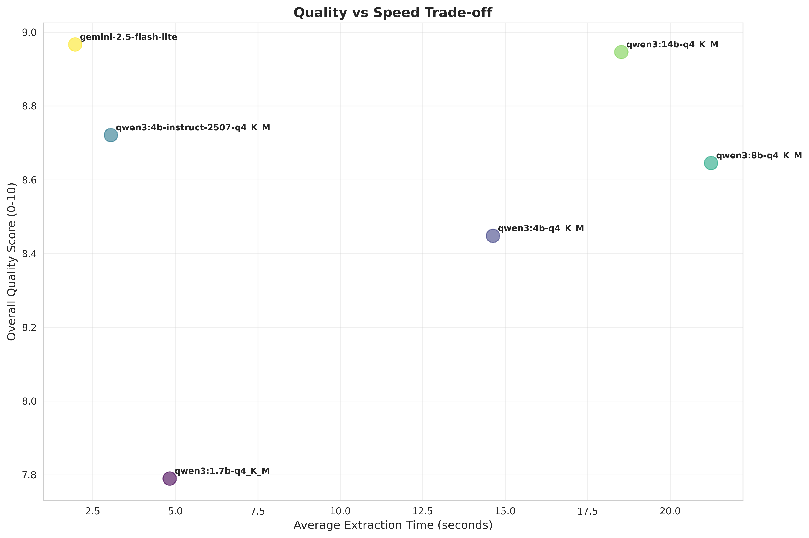
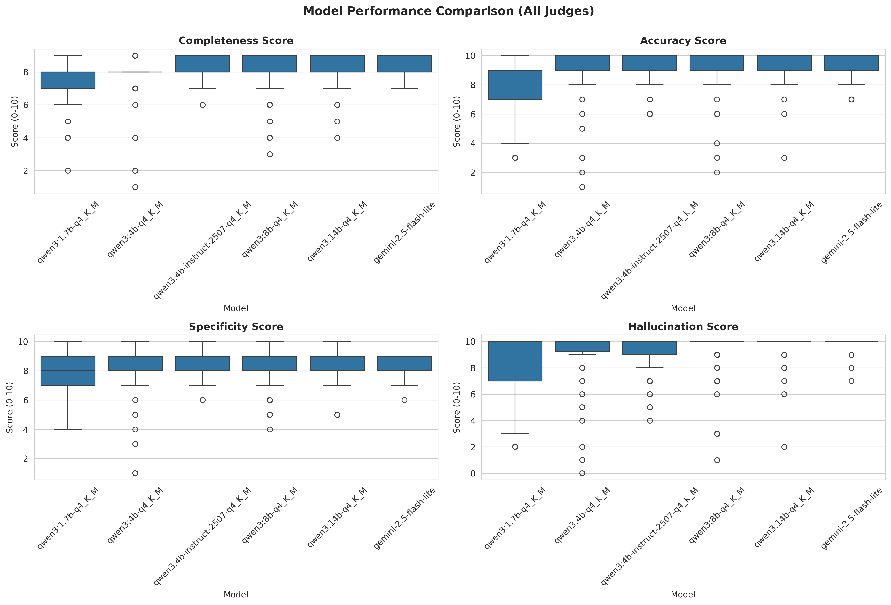

# LLM Job Extraction Benchmark

A small benchmark comparing 5 Qwen3 models (1.7B to 14B) + emini-2.5-flash-lite on real job description parsing. Dual-judge validation, bilingual testing (EN/FR).

The goal is to test if relatively small local models are capable of extracting information from real job posts while maintaining the accuracy of larger & cloud models.

**Note:** This is a small-scale experiment demonstrating what can be achieved with minimal prompt engineering. Further prompt refinement would likely improve results across all models.

---

## Methodology

### Dataset
- **30 real job posts** from Glassdoor
- **15 English, 15 French**
- Tech-focused (Data Science, ML, Software Dev)
- 800-4000 character descriptions

### Models Tested

**All local models use q4_K_M quantization** for optimal balance between quality and efficiency.

```text
Local (Ollama):
├── qwen3:1.7b-q4_K_M
├── qwen3:4b-q4_K_M
├── qwen3:4b-instruct-2507-q4_K_M
├── qwen3:8b-q4_K_M
└── qwen3:14b-q4_K_M

Cloud:
└── gemini-2.5-flash-lite
```

### Extraction Schema
```python
class JobEnrichment(BaseModel):
    required_skills: List[str]
    preferred_skills: List[str]
    experience_years_min: Optional[int]
    experience_years_max: Optional[int]
    seniority_level: Optional[str]  # Intern/Junior/Mid/Senior
    key_responsibilities: List[str]
    concrete_benefits: List[str]
    education_required: Optional[str]
    languages: List[str]
    remote_details: Optional[str]
    red_flags: List[str]
```

### Evaluation
- **Two AI judges**: GPT-4o + Claude Sonnet 4.5
- **Four metrics** (0-10 scale): Completeness, Accuracy, Specificity, Hallucination
- **Two prompts**: Direct vs Examples
- **840 total evaluations** (6 models × 30 jobs × 2 prompts × 2 judges)

### Hardware

- **GPU**: RTX 5080

---

## Summary of findings

### Winners by Category

| Category | Model | Score/Metric |
|----------|-------|-------------|
| **Best Overall** | `gemini-2.5-flash-lite` | 8.97/10 avg |
| **Best Local** | `qwen3:14b` | 8.95/10 avg |
| **Fastest** | `gemini-2.5-flash-lite` | ~2.0s per job |
| **Best Balance** | `qwen3:4b-instruct-2507` | 8.72/10, ~3.0s |

### Key Insights



1. **Simple prompts work better**: Direct instructions outperformed few-shot examples (+0.3 points average)
   - Exception: `gemini-2.5-flash-lite` performed slightly better with examples

2. **4B models are viable**: `qwen3:4b-instruct-2507` scored within 3% of the 14B model (8.72 vs 8.95)
   - Diminishing returns after 8B parameters
   - The instruct-tuned variant outperforms the base 4B model (8.72 vs 8.45)

3. **French posts harder**: ~0.5 point drop on average
   - `qwen3:1.7b`: -1.2 points
   - `gemini-2.5-flash-lite`: -0.2 points

4. **1.7B surprisingly capable**: 7.79/10 quality despite being 8x smaller than 14B
5. **French vs English**: Models were slightly worse on French (especially on the 1.7B)
6. **Dual Judge Evaluation**: High score correlation between the two judges. Upon manual analysis, `claude-sonnet-4-5` seems to be harsher than necessary while `gpt-4o` is too lenient and occasionally forgets to mention issues. This shows that LLM evaluations are limited and should only be used as a heuristic evaluation.

### Common Errors

**Most frequently missed** (from 680 evaluations), most are secondary info which may not be important (compared to the other information for this specific task)

- Team size (4.1%)
- Reports to (3.1%)
- Remote work details (2.6%)
- Salary ranges (1.2%)

**Hallucination rate**: < 0.8% across all models (very low)

### Summary

- Qwen models (starting from the 1.7B quantized variant) showed that they can achieve very close results to `gemini-2.5-flash-lite` on this task. The gap can be narrowed with improved prompting & simplifying the extraction into multiple rounds.

---

## Usage Examples

### Basic Extraction

```python
from src import extract_with_model, EXTRACTION_PROMPT_DIRECT
import outlines
from ollama import Client

# Initialize model
model = outlines.from_ollama(Client(), "qwen3:4b-q4_K_M")

# Extract from a job posting
job_description = """
Data Scientist - ML Team
Required: Python, SQL, 3-5 years experience
Responsibilities: Build ML models, analyze data
Benefits: Remote work, 60% transport reimbursement
"""

result = extract_with_model(
    job_description,
    model,
    "qwen3:4b",
    EXTRACTION_PROMPT_DIRECT
)

if result["success"]:
    print(f"Extracted in {result['extraction_time']:.2f}s")
    print(result["extraction"])
```

### Run Full Experiment

```python
from src import ExperimentRunner, ExperimentConfig

# Configure experiment
JUDGES =  {"gpt-4o": chatgpt,
           "claude-sonnet-4-5":claude}

CLOUD_EXTRACTORS = {"gemini-2.5-flash-lite": gemini,
                   }


# Configure
config = ExperimentConfig(
    local_models=[
                 "qwen3:1.7b-q4_K_M",
                 "qwen3:4b-q4_K_M",
                 "qwen3:4b-instruct-2507-q4_K_M",
                 "qwen3:8b-q4_K_M",
                 "qwen3:14b-q4_K_M",
                 "qwen3:30b"
                 ],
    cloud_models=["gemini-2.5-flash-lite"],
    judge_models=["claude-sonnet-4-5", "gpt-4o"],
    temperature=0.0,  # Deterministic outputs (almost)
    num_jobs=30
)
results_df = runner.run_experiment()

# Analyze
from src import analyze_results
analyze_results(results_df)
```

See `example_usage.py` for a complete working example.

---

## Quick Start

### Prerequisites

```bash
# Install Ollama
curl -fsSL https://ollama.com/install.sh | sh

# Pull the models used in the benchmark
ollama pull qwen3:1.7b-q4_K_M
ollama pull qwen3:4b-q4_K_M
ollama pull qwen3:4b-instruct-2507-q4_K_M
ollama pull qwen3:8b-q4_K_M
ollama pull qwen3:14b-q4_K_M

# Or pull just one to try it out
ollama pull qwen3:4b-q4_K_M
```

### Installation

```bash
git clone https://github.com/khaledabdallah/llm-job-extraction-benchmark.git
cd llm-job-extraction-benchmark

# Using uv (recommended)
uv sync

# Or pip (generate requirements first)
# uv pip compile pyproject.toml -o requirements.txt
pip install -r requirements.txt
```

### Set up environment

Create a `.env` file in the project root:

```bash
OPENAI_API_KEY=your-openai-key
ANTHROPIC_API_KEY=your-anthropic-key
GIMINI_API_KEY=your-google-key  # Optional, for Gemini models
```

### Run

```bash
# Run full benchmark
jupyter notebook experiement_llm_extraction.ipynb

# Or analyze existing results
jupyter notebook results_analysis.ipynb

# Or try quick example
python example_usage.py
```

---

## Results

### Full Performance Table

| Model | Quality | Speed | Completeness | Accuracy | Specificity | Hallucination |
|-------|---------|-------|--------------|----------|-------------|---------------|
| qwen3:1.7b | 7.79/10 | 4.8s | 7.2 | 8.1 | 7.6 | 8.3 |
| qwen3:4b | 8.45/10 | 14.6s | 7.8 | 8.8 | 8.1 | 9.2 |
| qwen3:4b-2507 | 8.72/10 | 3.0s | 8.3 | 9.1 | 8.5 | 9.1 |
| qwen3:8b | 8.65/10 | 21.2s | 7.8 | 9.1 | 8.2 | 9.5 |
| qwen3:14b | 8.95/10 | 18.5s | 8.2 | 9.4 | 8.6 | 9.7 |
| gemini-flash | **8.97/10** | 2.0s | 8.3 | 9.3 | 8.5 | 9.7 |



### Visualizations

All plots available in `figs/`:
- `model_comparison.png` - Overall performance
- `judge_agreement.png` - GPT-4o vs Claude correlation (r=0.89)
- `quality_vs_speed.png` - Tradeoff analysis
- `prompt_per_model_analysis.png` - Direct vs Examples
- `language_analysis.png` - English vs French performance
- `error_analysis.png` - What models miss/hallucinate

---

## Recommendations

### Production Use

**High-volume (1000s jobs/day)**:
```python
model = "qwen3:4b-instruct-2507-q4_K_M"  # 8.72/10, 3.0s, runs locally
```

**Quality-critical**:
```python
model = "qwen3:14b-q4_K_M"  # 8.95/10, 18.5s
# or
model = "gemini-2.5-flash-lite"  # 8.97/10, 2.0s (API)
```

**Best balance**:
```python
model = "qwen3:4b-instruct-2507-q4_K_M"  # 8.72/10, 3.0s
```

### Prompt Tips

**Use:**
- Simple, direct instructions
- "ONLY extract what's explicitly stated"
- Request null for missing fields
- Show schema structure

**Avoid:**
- Too many few-shot examples (confuses small models)
- Asking for interpretation
- Vague scoring criteria

---

## Repository Structure

```
llm-job-extraction-benchmark/
├── README.md
├── experiement_llm_extraction.ipynb  # Run benchmark
├── results_analysis.ipynb            # Analysis + visualizations
├── example_usage.py                  # Quick start example
├── data/
│   ├── jobs_samples.csv              # 30 jobs
│   ├── extraction_experiment_results.csv
│   └── extraction_experiment_results.pkl
├── figs/                             # All plots
├── src/
│   ├── __init__.py                   # Module exports
│   ├── schemas.py                    # Pydantic models
│   ├── extraction.py                 # Extraction functions & prompts
│   ├── evaluation.py                 # Judge evaluation
│   └── runner.py                     # Experiment orchestration
└── pyproject.toml                    # Dependencies
```

---

## Limitations

- **Small dataset**: 30 jobs (tech-focused)
- **AI judges**: No human ground truth
- **Tech sector only**: Patterns may differ in other industries
- **Prompt Limits**: Only two prompts were benchmarked; other variations can change the results
- **Minimal prompt engineering**: This experiment demonstrates baseline performance with simple prompts. Iterative prompt refinement would likely improve all models

---

## Citation

```bibtex
@misc{bouabdallah2025llmjobextraction,
  author = {Khaled Bouabdallah},
  title = {LLM Job Extraction Benchmark},
  year = {2025},
  publisher = {GitHub},
  url = {https://github.com/khaledabdallah/llm-job-extraction-benchmark}
}
```

---

## License

MIT License - see LICENSE file.

---

## Contact

**Khaled Bouabdallah**
- GitHub: [@khaledabdallah](https://github.com/khaledabdallah)
